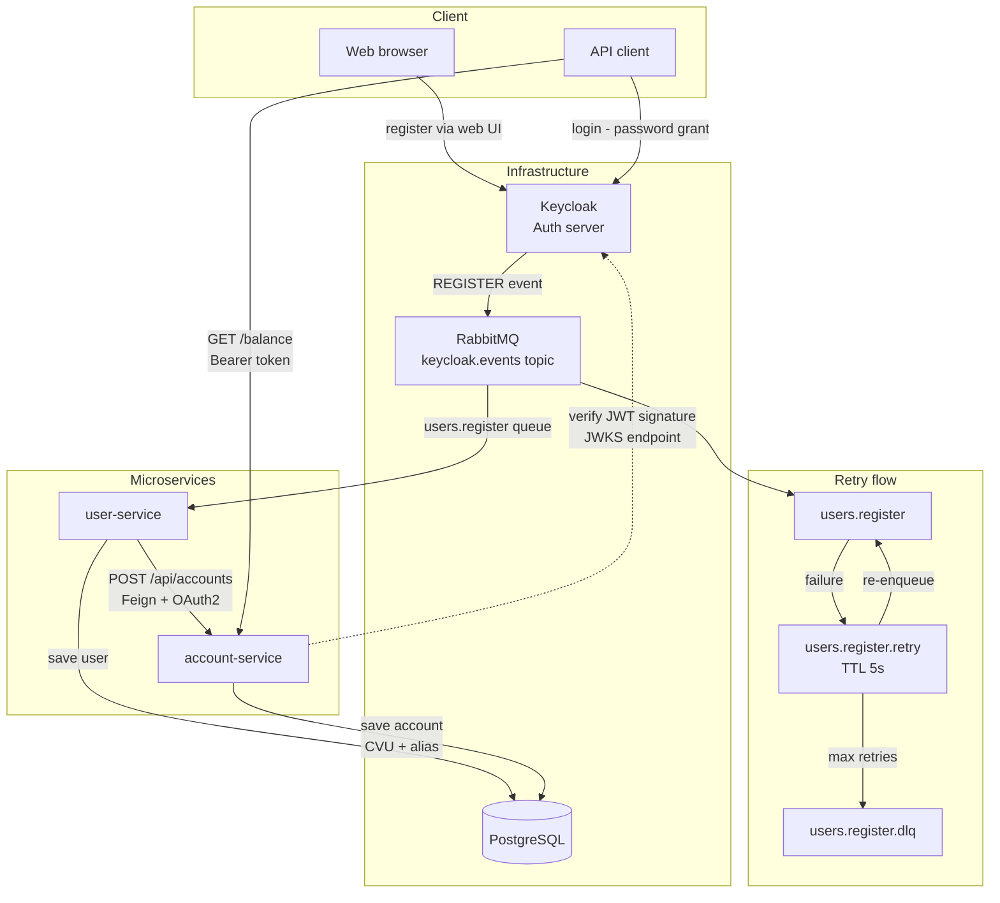

# 💸 Digital Money 💸

## 🚀 Getting Started

### Prerequisites
- [Docker Desktop](https://www.docker.com/products/docker-desktop/) installed and running

### 1. Configure the hosts file

This project uses a custom Keycloak hostname. You need to add the following line to your system's hosts file: 127.0.0.1 keycloak

**Linux/Mac:**
```bash
echo "127.0.0.1 keycloak" | sudo tee -a /etc/hosts
```

**Windows** (run Notepad as Administrator and open the file): C:\Windows\System32\drivers\etc\hosts
Add the following line at the end of the file: 127.0.0.1 keycloak

### 2. Run the application

```bash
docker compose up --build
```

> ⚠️ The first time this runs it will take several minutes as it compiles all microservices from source.

### 3. Access the services

| Service | URL |
|---|---|
| Keycloak Admin Panel | http://localhost:8080/admin |
| Keycloak Login/Register | http://keycloak:8080/realms/DH_BACKEND/account |
| Eureka Dashboard | http://localhost:8761 |
| RabbitMQ Management | http://localhost:15672 |
| Users Service | http://localhost:8081 |
| Account Service | http://localhost:8082 |

> **Keycloak credentials:** `admin` / `admin`  
> **RabbitMQ credentials:** `guest` / `guest`


## 🔄 Application flow



## Repositories

### 👤 user-services
This repository is responsible for user management. It mainly works as a listener of **Keycloak** events through **RabbitMQ**, as Keycloak notifies it about new registrations. The service then processes this information to create the user in the database and sends it to the **account-services** for account creation.

### 📃 account-services 
This repository is responsible for account management. Each account has only one user, and during its creation, a **random CVU and alias** are generated. The record is then saved in the database. Through this service, you can also retrieve account activities and other data related to the account

### 🌐 eureka-server
This repository is responsible for services discovery.

## Files & Information

### 💻 Testing
📊 [Test cases](https://docs.google.com/spreadsheets/d/1z_agAX3k-7RcVEggPbZ4cXiwgI0i6AYQSseCMh6qpLk/edit?usp=sharing)<br>
📄 [Testing kickoff](https://docs.google.com/document/d/1OHKRKZz-7bGd7lRbHqYEZrjIU8w2WfGwCOxAinCIb1o/edit?usp=sharing)<br>
🧪 [Exploratory testing](https://docs.google.com/document/d/1kvjgwxN0ka8X7SCvaZqrf38NQIea8i_rsclJXEghA-A/edit?usp=sharing)

## Infrastructure

### 🐳 Docker compose

> **Custom Image Notice**  
> This project uses a custom Keycloak Docker image that includes a custom Event Listener SPI developed by me.  
> The Event Listener is responsible for notifying the system when a user is registered.

```
services:
  postgres:
    image: postgres:15
    container_name: postgres
    restart: unless-stopped
    environment:
      POSTGRES_DB: <database>
      POSTGRES_USER: <user>
      POSTGRES_PASSWORD: <pass>
      TZ: UTC
      PGTZ: UTC
    ports:
      - "5432:5432"
    volumes:
      - pg_data:/var/lib/postgresql/data

  keycloak:
    image: ghcr.io/digital-money-nicolas-diez/keycloak-docker-image:1.0.0
    environment:
      KC_DB: postgres
      KC_DB_URL: jdbc:postgresql://postgres:5432/app_db
      KC_DB_USERNAME: <user>
      KC_DB_PASSWORD: <pass>
      KEYCLOAK_ADMIN: <user>
      KEYCLOAK_ADMIN_PASSWORD: <pass>
    ports:
      - "8080:8080"

  rabbitmq:
    image: rabbitmq:4.2.2-management
    container_name: rabbitmq
    restart: unless-stopped
    ports:
      - "5672:5672"
      - "15672:15672"
    environment:
      RABBITMQ_DEFAULT_USER: <user>
      RABBITMQ_DEFAULT_PASS: <pass>

volumes:
  pg_data:
```

### 📦 Database ERD

As in most financial systems, a user has one account, and an account can have one or more activities. This business logic is represented in the database.
U can check the ERD file [here](./PG-ERD).


