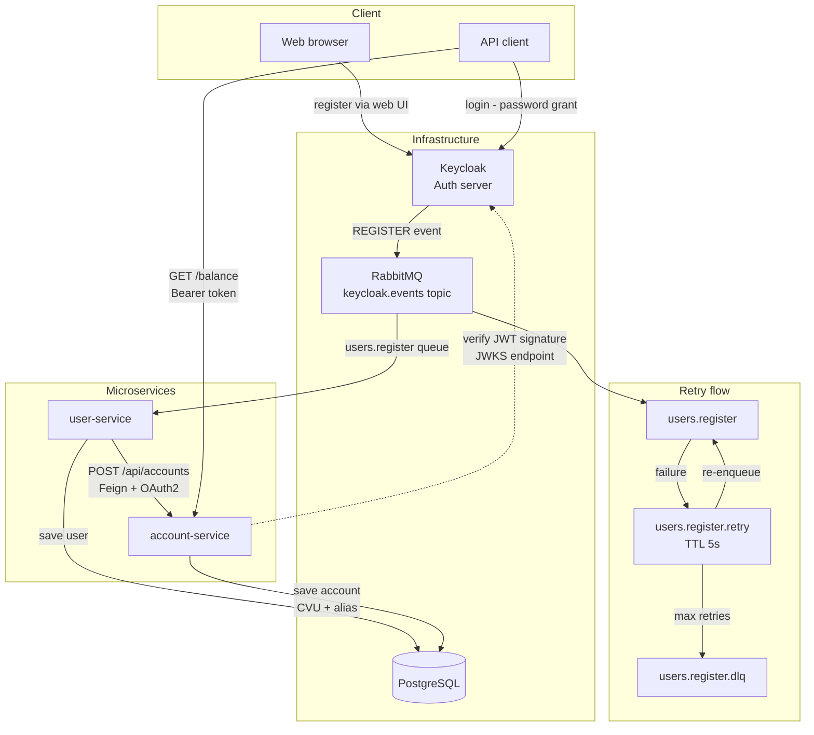

# 💸 Digital Money 💸

## 🚀 Getting Started

### Prerequisites
- [Docker Desktop](https://www.docker.com/products/docker-desktop/) installed and running
- [Git](https://git-scm.com/) installed
- Java 21 and Maven (only required for Hybrid mode)

### 1. Clone the devops repository

```bash
git clone https://github.com/Digital-Money-Nicolas-Diez/devops.git
cd devops
```

### 2. Choose a run mode

| Mode | Description | Guide |
|---|---|---|
| 🐳 **Customer** | Run everything with Docker. No local setup required. | [Customer Guide](./CUSTOMER.md) |
| 🔧 **Developer** | Run infrastructure with Docker and microservices locally from your IDE. | [Developer Guide](./DEVELOPER.md) |

---

## 🔄 Application flow



---

## 📖 API Documentation

The endpoints are documented with Swagger UI and are available once the application is running:

| Service | URL |
|---|---|
| Account Service | http://localhost:8082/swagger-ui/index.html |

---

## 📚 Repositories

### 🐳 devops
Infrastructure configuration to run the project locally. Includes `docker-compose.yml` and the PostgreSQL initialization script (`init.sql`).

### 👤 user-service
Responsible for user management. Listens to **Keycloak** registration events through **RabbitMQ** and creates users in the database. Then notifies the **account-service** to create the associated account.

### 📃 account-service
Responsible for account management. Each account has one user. During creation, a **random CVU and alias** are generated. Also exposes endpoints for account balance and activity history.

### 🌐 eureka-server
Responsible for service discovery.

### 🔑 keycloak
Custom Keycloak Docker image. Includes the Event Listener SPI JAR and the realm configuration (`realm-export.json`), which is automatically imported on startup.

### 🔐 JwtConverterLib
Shared library containing the JWT authentication converter and security configuration template used by all microservices. Built automatically in Full Docker mode. Requires manual install in Hybrid mode.

---

## 📦 Database ERD

As in most financial systems, a user has one account, and an account can have one or more activities. You can check the ERD [here](./PG-ERD).


---

## 💻 Testing

📊 [Test cases](https://docs.google.com/spreadsheets/d/1z_agAX3k-7RcVEggPbZ4cXiwgI0i6AYQSseCMh6qpLk/edit?usp=sharing)<br>
📄 [Testing kickoff](https://docs.google.com/document/d/1OHKRKZz-7bGd7lRbHqYEZrjIU8w2WfGwCOxAinCIb1o/edit?usp=sharing)<br>
🧪 [Exploratory testing](https://docs.google.com/document/d/1kvjgwxN0ka8X7SCvaZqrf38NQIea8i_rsclJXEghA-A/edit?usp=sharing)
