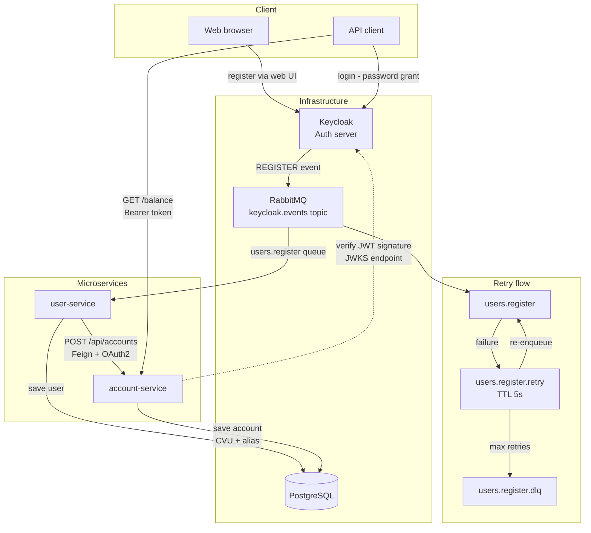
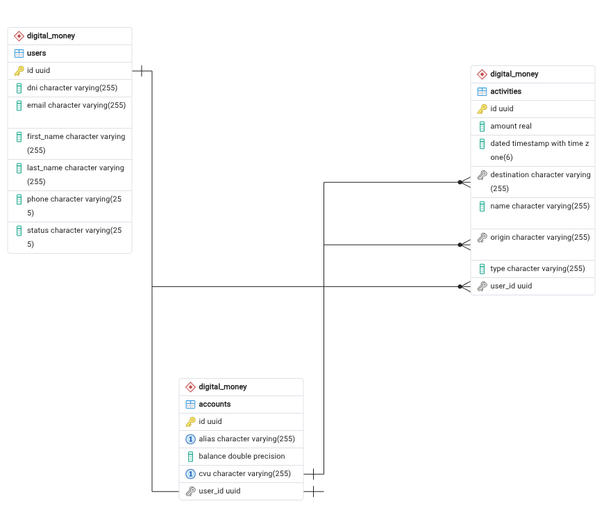

# 💸 Digital Money 💸

## 🚀 Getting Started

### Prerequisites
- [Docker Desktop](https://www.docker.com/products/docker-desktop/) installed and running
- [Git](https://git-scm.com/) installed

### 1. Clone the devops repository

```bash
git clone https://github.com/Digital-Money-Nicolas-Diez/devops.git
cd devops
```

### 2. Configure the hosts file

> ⚠️ Only required for Full Docker mode.

This project uses a custom Keycloak hostname. Add the following line to your system's hosts file: 127.0.0.1 keycloak

**Linux/Mac:**
```bash
echo "127.0.0.1 keycloak" | sudo tee -a /etc/hosts
```

**Windows** (run Notepad as Administrator and open the file): C:\Windows\System32\drivers\etc\hosts  
Add the following line at the end: 127.0.0.1 keycloak

### 3. Run the application

**Full Docker — just want to use the app**  
Run everything with Docker:
```bash
docker compose up --build
```

**Hybrid — development mode**  
Run only the infrastructure services and start the microservices locally from your IDE:
```bash
docker compose up postgres rabbitmq keycloak eureka-service
```
Then run `user-service` and `account-service` locally. This allows you to test and debug the services more easily.

### 4. Access the services

| Service | URL |
|---|---|
| Keycloak Admin Panel | http://localhost:8080/admin |
| Keycloak Login/Register | http://keycloak:8080/realms/DH_BACKEND/account |
| Eureka Dashboard | http://localhost:8761 |
| RabbitMQ Management | http://localhost:15672 |
| Users Service | http://localhost:8081 |
| Account Service | http://localhost:8082 |

> **Keycloak credentials:** `admin` / `admin`  
> **RabbitMQ credentials:** `guest` / `guest`

### Ports reference

| Service | Port | Protocol |
|---|---|---|
| Keycloak | 8080 | HTTP |
| user-service | 8081 | HTTP |
| account-service | 8082 | HTTP |
| Eureka | 8761 | HTTP |
| RabbitMQ | 5672 | AMQP |
| RabbitMQ Management | 15672 | HTTP |
| PostgreSQL | 5432 | TCP |

---

## 🔄 Application flow



### Getting a token

To test authenticated endpoints, first obtain a Bearer token from Keycloak.
```http
POST http://keycloak:8080/realms/DH_BACKEND/protocol/openid-connect/token
Content-Type: application/x-www-form-urlencoded
```

| Field | Value |
|---|---|
| `grant_type` | `password` |
| `client_id` | `gateway` |
| `username` | your registered username |
| `password` | your registered password |

Use the `access_token` field from the response as a Bearer token in your requests.

### Registering a user

User registration is handled directly by Keycloak.  
Go to http://keycloak:8080/realms/DH_BACKEND/account and create an account.  
Once registered, the system automatically creates a bank account for the user.

> ⚠️ Make sure you have configured the hosts file as described above. Otherwise replace `keycloak` with `localhost`.

---

## 📖 API Documentation

The endpoints are documented with Swagger UI and are available once the application is running:

| Service | URL |
|---|---|
| Account Service | http://localhost:8082/swagger-ui/index.html |

---

## 📚 Repositories

### 🐳 devops
This repository contains the infrastructure configuration to run the project locally. It includes the `docker-compose.yml` and the PostgreSQL initialization script (`init.sql`).

### 👤 user-service
This repository is responsible for user management. It mainly works as a listener of **Keycloak** events through **RabbitMQ**, as Keycloak notifies it about new registrations. The service then processes this information to create the user in the database and sends it to the **account-service** for account creation.

### 📃 account-service
This repository is responsible for account management. Each account has only one user, and during its creation, a **random CVU and alias** are generated. The record is then saved in the database. Through this service you can also retrieve account activities and other account-related data.

### 🌐 eureka-server
This repository is responsible for service discovery.

### 🔑 keycloak
This repository contains the custom Keycloak Docker image. It includes the custom Event Listener SPI JAR and the realm configuration (`realm-export.json`), which is automatically imported on startup.

---

## 📦 Database ERD

As in most financial systems, a user has one account, and an account can have one or more activities. You can check the ERD [here](./PG-ERD).



---

## 💻 Testing

📊 [Test cases](https://docs.google.com/spreadsheets/d/1z_agAX3k-7RcVEggPbZ4cXiwgI0i6AYQSseCMh6qpLk/edit?usp=sharing)<br>
📄 [Testing kickoff](https://docs.google.com/document/d/1OHKRKZz-7bGd7lRbHqYEZrjIU8w2WfGwCOxAinCIb1o/edit?usp=sharing)<br>
🧪 [Exploratory testing](https://docs.google.com/document/d/1kvjgwxN0ka8X7SCvaZqrf38NQIea8i_rsclJXEghA-A/edit?usp=sharing)
