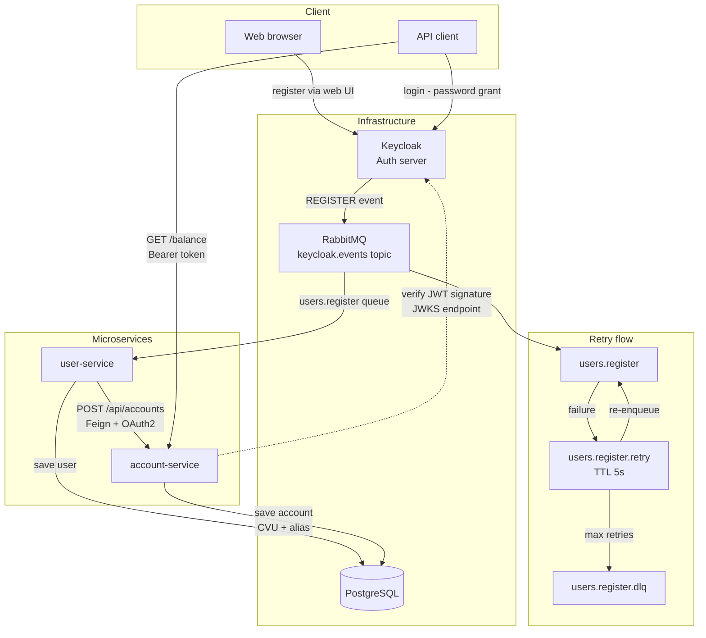

# 💸 Digital Money 💸

## 🚀 Getting Started

### Prerequisites
- [Docker Desktop](https://www.docker.com/products/docker-desktop/) installed and running

### 1. Configure the hosts file

This project uses a custom Keycloak hostname. You need to add the following line to your system's hosts file: 127.0.0.1 keycloak

**Linux/Mac:**
```bash
echo "127.0.0.1 keycloak" | sudo tee -a /etc/hosts
```

**Windows** (run Notepad as Administrator and open the file): C:\Windows\System32\drivers\etc\hosts
Add the following line at the end of the file: 127.0.0.1 keycloak

### 2. Run the application

```bash
docker compose up --build
```

> ⚠️ The first time this runs it will take several minutes as it compiles all microservices from source.

### 3. Access the services

| Service | URL |
|---|---|
| Keycloak Admin Panel | http://localhost:8080/admin |
| Keycloak Login/Register | http://keycloak:8080/realms/DH_BACKEND/account |
| Eureka Dashboard | http://localhost:8761 |
| RabbitMQ Management | http://localhost:15672 |
| Users Service | http://localhost:8081 |
| Account Service | http://localhost:8082 |

> **Keycloak credentials:** `admin` / `admin`  
> **RabbitMQ credentials:** `guest` / `guest`


### Ports reference

| Service | Port | Protocol |
|---|---|---|
| Keycloak | 8080 | HTTP |
| user-service | 8081 | HTTP |
| account-service | 8082 | HTTP |
| Eureka | 8761 | HTTP |
| RabbitMQ | 5672 | AMQP |
| RabbitMQ Management | 15672 | HTTP |
| PostgreSQL | 5432 | TCP |


## 🔄 Application flow



### Getting a token

To test authenticated endpoints, first obtain a Bearer token from Keycloak.
```http
POST http://keycloak:8080/realms/DH_BACKEND/protocol/openid-connect/token
Content-Type: application/x-www-form-urlencoded
```

**Body:**
| Field | Value |
|---|---|
| `grant_type` | `password` |
| `client_id` | `gateway` |
| `username` | your registered username |
| `password` | your registered password |

**Response:** use the `access_token` field as a Bearer token in your requests.

### Registering a user

User registration is handled directly by Keycloak.
Go to http://keycloak:8080/realms/DH_BACKEND/account and create an account.
Once registered, the system automatically creates a bank account for the user.
> ⚠️ Make sure you have configured the hosts file as described in the [Getting Started](#-getting-started) section. Otherwise replace `keycloak` with `localhost`.

## 📖 API Documentation

The endpoints are documented with Swagger UI and are available once the application is running:

| Service | URL |
|---|---|
| Account Service | http://localhost:8082/swagger-ui/index.html |

## 📚 Repositories

### 👤 user-services
This repository is responsible for user management. It mainly works as a listener of **Keycloak** events through **RabbitMQ**, as Keycloak notifies it about new registrations. The service then processes this information to create the user in the database and sends it to the **account-services** for account creation.

### 📃 account-services 
This repository is responsible for account management. Each account has only one user, and during its creation, a **random CVU and alias** are generated. The record is then saved in the database. Through this service, you can also retrieve account activities and other data related to the account

### 🌐 eureka-server
This repository is responsible for services discovery.

## Files & Information

### 💻 Testing
📊 [Test cases](https://docs.google.com/spreadsheets/d/1z_agAX3k-7RcVEggPbZ4cXiwgI0i6AYQSseCMh6qpLk/edit?usp=sharing)<br>
📄 [Testing kickoff](https://docs.google.com/document/d/1OHKRKZz-7bGd7lRbHqYEZrjIU8w2WfGwCOxAinCIb1o/edit?usp=sharing)<br>
🧪 [Exploratory testing](https://docs.google.com/document/d/1kvjgwxN0ka8X7SCvaZqrf38NQIea8i_rsclJXEghA-A/edit?usp=sharing)

## Infrastructure

### 🐳 Docker compose

> **Custom Image Notice**  
> This project uses a custom Keycloak Docker image that includes a custom Event Listener SPI developed by me.  
> The Event Listener is responsible for notifying the system when a user is registered.

```
services:

  postgres:
    image: postgres:15
    container_name: postgres
    restart: unless-stopped
    environment:
      POSTGRES_DB: app_db
      POSTGRES_USER: app_user
      POSTGRES_PASSWORD: app_pass
      TZ: UTC
      PGTZ: UTC
    ports:
      - "5432:5432"
    volumes:
      - pg_data:/var/lib/postgresql/data
    healthcheck:
      test: ["CMD-SHELL", "pg_isready -U app_user -d app_db"]
      interval: 10s
      timeout: 5s
      retries: 5

  keycloak:
    restart: unless-stopped
    image: ghcr.io/digital-money-nicolas-diez/keycloak-docker-image:1.0.1
    environment:
      KC_DB: postgres
      KC_DB_URL: jdbc:postgresql://postgres:5432/app_db
      KC_DB_USERNAME: app_user
      KC_DB_PASSWORD: app_pass
      KEYCLOAK_ADMIN: admin
      KEYCLOAK_ADMIN_PASSWORD: admin
      KC_HOSTNAME: http://keycloak:8080
      KC_HOSTNAME_ADMIN: http://localhost:8080
      KC_HOSTNAME_STRICT: "false"
      KC_HTTP_ENABLED: "true"
    ports:
      - "8080:8080"
    depends_on:
      postgres:
        condition: service_healthy

  rabbitmq:
    image: rabbitmq:4.2.2-management
    container_name: rabbitmqv
    restart: unless-stopped
    ports:
      - "5672:5672"
      - "15672:15672"
    environment:
      RABBITMQ_DEFAULT_USER: guest
      RABBITMQ_DEFAULT_PASS: guest
    healthcheck:
      test: ["CMD", "rabbitmq-diagnostics", "ping"]
      interval: 10s
      timeout: 5s
      retries: 5

  user-service:
    build:
      context: https://github.com/Digital-Money-Nicolas-Diez/users-service.git#master
      dockerfile: Dockerfile
    container_name: user-service
    restart: unless-stopped
    ports:
      - "8081:8081"
    environment:
      SPRING_DATASOURCE_URL: jdbc:postgresql://postgres:5432/app_db?options=-c%20TimeZone=UTC
      SPRING_RABBITMQ_HOST: rabbitmq
      ACCOUNT_SERVICE_URL: http://account-service:8082
      EUREKA_URI: http://eureka-service:8761/eureka
      SPRING_SECURITY_OAUTH2_CLIENT_PROVIDER_KEYCLOAK_TOKEN_URI: http://keycloak:8080/realms/DH_BACKEND/protocol/openid-connect/token
    depends_on:
      postgres:
        condition: service_healthy
      rabbitmq:
        condition: service_healthy
      keycloak:
        condition: service_started
      eureka-service:
        condition: service_started

  account-service:
    build:
      context: https://github.com/Digital-Money-Nicolas-Diez/account-service.git#master
      dockerfile: Dockerfile
    container_name: account-service
    restart: unless-stopped
    ports:
      - "8082:8082"
    environment:
      SPRING_DATASOURCE_URL: jdbc:postgresql://postgres:5432/app_db?options=-c%20TimeZone=UTC
      EUREKA_URI: http://eureka-service:8761/eureka
      SPRING_SECURITY_OAUTH2_RESOURCESERVER_JWT_ISSUER_URI: http://keycloak:8080/realms/DH_BACKEND
    depends_on:
      postgres:
        condition: service_healthy
      keycloak:
        condition: service_started
      eureka-service:
        condition: service_started

  eureka-service:
    build:
      context: https://github.com/Digital-Money-Nicolas-Diez/eureka-server.git#main
      dockerfile: Dockerfile
    container_name: eureka
    restart: unless-stopped
    ports:
      - "8761:8761"

volumes:
  pg_data:

```

### 📦 Database ERD

As in most financial systems, a user has one account, and an account can have one or more activities. This business logic is represented in the database.
U can check the ERD file [here](./PG-ERD).


